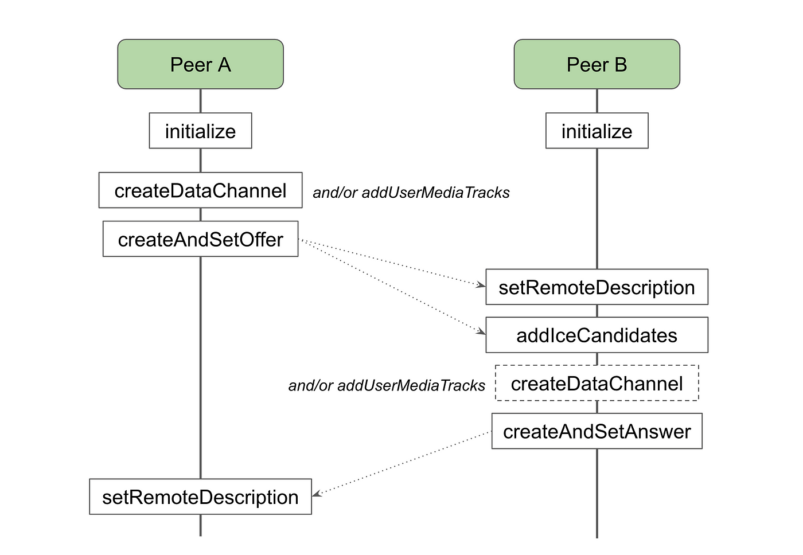

# GMeet Alternative

Welcome to our hackathon project! This platform is designed to revolutionize online meetings by integrating advanced features such as AI-powered summarization and transcription. We have built the entire WebRTC infrastructure from the ground up, ensuring seamless real-time video and audio communication.

## Table of Contents
- [Introduction](#introduction)
- [Features](#features)
- [Tech Stack](#tech-stack)
- [Usage](#usage)
- [Contributors](#contributors)


## Introduction
GMeet Alternative is an online meeting platform created during a hackathon. The platform offers several innovative features, including AI-powered summarization and transcription, to enhance user productivity and collaboration. Built with a robust WebRTC infrastructure, our solution ensures seamless real-time video and audio communication.

## Features
- **AI Summarization**: Get concise summaries of your meetings.
- **Realtime Video Conferencing**: Seamless video communication with low latency.
- **Screen Sharing**: Share screens during meetings.

## Screenshots
### Homepage


### Meeting Interface


### WebRTC Implementation



## Tech Stack
- **Frontend**: Next.js, Tailwind CSS
- **Backend**: Node.js, Express
- **AI Services**: Text summarization, Speech-to-Text APIs
- **Database**: MongoDB
- **Realtime Communication**: WebRTC, Socket.io


### Prerequisites
- Node.js and npm installed on your machine
- MongoDB installed and running
- Git installed on your machine

### Installation
1. **Clone the repository**:
    ```sh
    git clone https://github.com/GmeetAlternative/GmeetAlternative.git
    cd GmeetAlternative
    ```

2. **Install backend dependencies**:
    ```sh
    cd backend
    npm install
    ```

3. **Install frontend dependencies**:
    ```sh
    cd ../frontend
    npm install
    ```

4. **Configure environment variables**:
    - Create a `.env` file in the `backend` directory and add the following:
        ```env
        MONGODB_URI=your_mongodb_connection_string
        PORT=4000
        JWT_SECRET=your_jwt_secret
        HUGGING_FACE_API_KEY=your_hugging_face_api_key
        ```

5. **Run the backend server**:
    ```sh
    cd backend
    npm run build
    npm run start
    ```

6. **Run the frontend server**:
    ```sh
    cd ../frontend
    npm run dev
    ```

### Usage
1. **Start a meeting**: Login and navigate to the dashboard and enter a roomid click on "Start Meeting".
2. **Join a meeting**: Enter the room ID and join an existing meeting.
3. **AI Features**: After the meeting, the AI summarization and transcription features enhance the experience.

## Contributors
- **Mohit Verma** - emvee - [GitHub](https://github.com/mohitvermax)
- **Tanisha Dixit** - rhapsody - [GitHub](https://github.com/tanishadixit0206)
